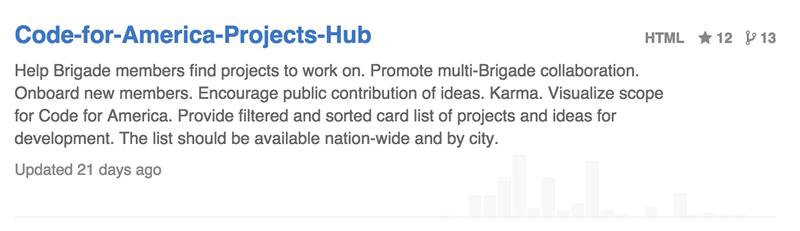
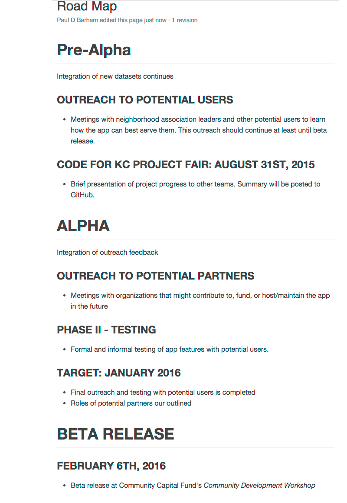
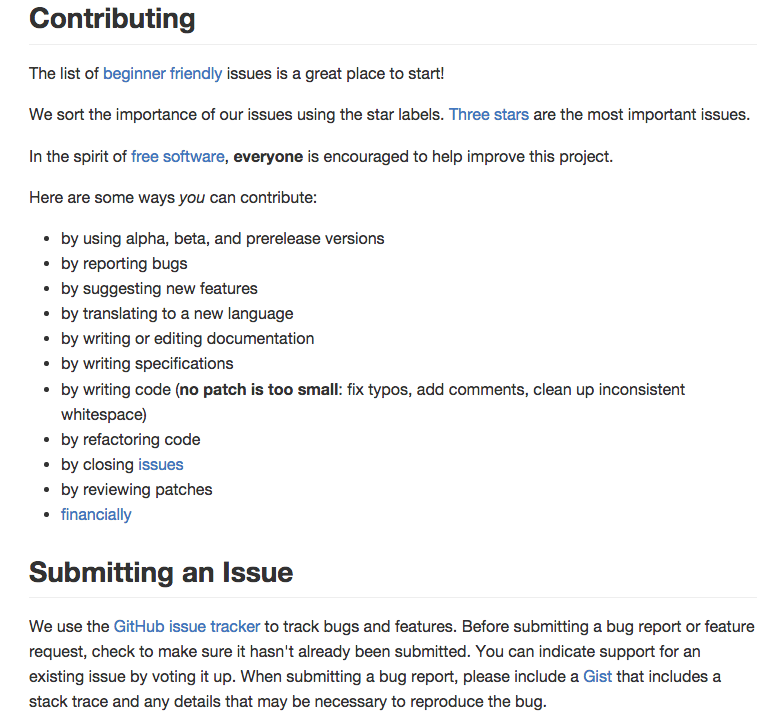
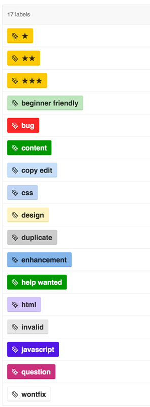
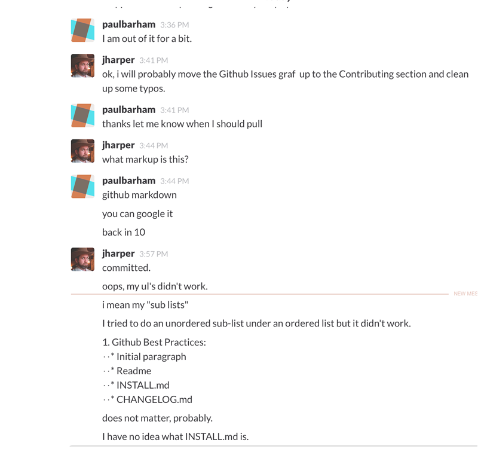

# Code For KC Project Centering

Our goal between now and 8/31 is to get every team in shape for

* Successful launches in November
* Selling your project to potential users
* Engaging potential team members.

 This includes getting team members
re-engaged, getting your github repos and readmes cleaned up,
outlining clear roadmaps, defining goals and milestones to successful
November launch, and so forth.

# Pre Activity
On a card for each, write down

* things that are blocking progress of your project
* future needs of your project
* things you are doing well

## In this workshop, we'll cover...

1. Github Best Practices: Initial paragraph, Readme, Install.md, Changelog.md

2. Contributing/Issues

3. Engaging Team Members 

#1. Github Best Practices: 

## Initial Paragraph

This is seen in many places, and you can include a link to something live!

This example might be a bit to long, but is still good.

## Readme

* What is the project? Why would someone else care to use the application, or help improve the application?  
* Include an example of code or screen shot of an app
* What are the requirements?
  Think more than coding and technology.  What data would someone
  need to have to implement this project?  What other skills besides
  installing the software on a server are needed?  For example,
  implementing a 211 system would require good skills organizing and
  leadership to ingage other organizations that have the data and
  already have working applications.
* Install/implementation instructions, if long put in INSTALL.md
* How to contribute
* Can include
  * Development Setup
  * Technology Patterns

* RoadMap, again if long put in the Wiki

## INSTALL.md
If the install instructions are over a few lines in the README, you might consider breaking them out into their own files.

## CHANGELOG.md
It is a good idea to keep a changelog. According to Wikipedia, a changelog is a log or record of all the changes made to a project, usually including such records as bug fixes, new features, etc. Some open source projects include a changelog as one of the top level files in their distribution. 

* See <https://github.com/cfpb/qu> and <https://github.com/cfpb/hmda-explorer>
* Some Inspiration: <http://keepachangelog.com/>

#2. Issues & Contributing 

From [https://github.com/codeforkansascity/bizfriendly-web](https://github.com/codeforkansascity/bizfriendly-web)

## GitHub Issues

Have a question? Open an issue. Have an idea? Open an issue. Notice
something’s a bit wonky? You guessed it, open an issue. Issues are
cheap. They cost seconds to create, and even if duplicative, are
closed just as easily. Issues start conversations, surface alternate
points of view, and most importantly, create permanent, searchable,
and linkable records of internal discussions, even if the answer
ultimately landed on is “wontfix”.

* Search before you open an issue
* Provide context
* Issues are constructive criticism

From http://ben.balter.com/2014/11/06/rules-of-communicating-at-github/

#3. Re-engaging members & communication

## Email: A Mixed Bag

Email is a terrible, terrible collaboration medium, and an even
worse mechanism for storing organizational knowledge. There’s no
opt-in or opt-out mechanisms, no ability to link to or cross-reference
discussions, and conversation history lives in a teammate’s personal
inbox, so when they leave so too does the issue’s context. Use email
sparingly, and only when issues or chat, exposed to the company,
would be inappropriate for the conversation. Put another way, email
is for sensitive conversations.

From http://ben.balter.com/2014/11/06/rules-of-communicating-at-github/

## Better: Hangouts and Face to Face

* Brainstorming
* Feedback
* Small talk and gossip

## Best: Slack

* cordinating when working remotely 
* coordinating meetings time to do things
* annoucements
* discussion/sanity chek of ideas before they become issues or items on the Wiki

